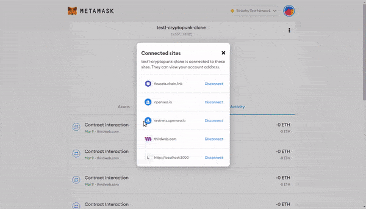
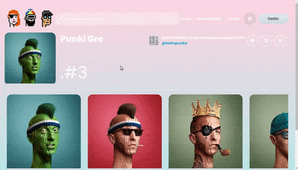

## Beginner Exercises 🍭

 

- lesson 1 - what-is-a-smart-contract

- lesson 2 - my-first-smart-contract

### 🚧 (private) [smartcontracts-lesson1-ethereum-solidity](https://github.com/nadiamariduena/smartcontracts-lesson1-ethereum-solidity)

 
 

---

### 🚧 In progress | [amazon-clone-blockchain](https://github.com/nadiamariduena/amazon-clone-blockchain)

>Amazon Web 3.0 Blockchain App with Solidity | Moralis | Next.js | Ethers.js | Tailwind CSS

 
 

---

 
 

### Build OpenSea Blockchain Web 3.0 App with Next.js | Sanity.io | thirdweb 🍨

> Big thanks to CleverProgrammers , for sharing this Great tutorial on how to set up an OpenSea Blockchain Web 3.0 App with Next.js | Sanity.io | thirdweb | Tailwind | Alchemy

#### [opensea-marketplace](https://github.com/nadiamariduena/opensea-marketplace)

 

1-yarn-default-setup

2.sanityio-installation

3-metamask-thirweb-connection-market-nft-setup-sanity-last-details

4-header-tailwing-routing

5-hero-component

6-sanity-auth-and-notification-with-toaster

7-collection-page-nftmodule-marketplace-listing-alchemy-dynamic.creating-user-sanity

8-nft-individualpath-imagevisibility-issue-purchase-button

9-deployment-cors-sanity

 

#### Log in to the app with your metamask (I am using Rinkeby test Network)

 
 

---

 
 

### Fake BoredApe... 🌴

##### This is a basic app, that has no real functionality other than: fetching the data from opensea ✋

 

> In this tutorial you will get familiar with creating **NFT's in testing mode** (using specific networks for that matter in **metamask & thirdweb** ), you will also learn hot to create **fake ethereum** (with faucets.chain ) to be used in your tests apps.

 

